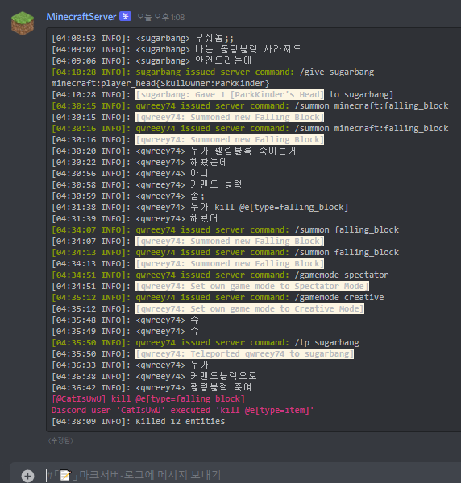

# Disbucket

> **A minecraft server bucket wrapper for discord that built on luajit/uv**  
이 프로그램은 luajit 를 이용하여 *무식할 정도로 빠른 속도*를 보여줍니다  
2기가 렘 / ARM64 CPU (2017 년형 / 8코어 2.3GHz) 에서도 원활한 동작을 확인했습니다  
(CPU : 0.3~1%, RAM : 16MB, 단 서버 크기에 따라 달라질 수 있음)  

디스코드를 통해 서버의 로그와 명령어, 채팅을 연동합니다.

  
  
  

디스코드 채팅창에 메시지를 입력하면 인게임에서 표시되며, 로그에 남습니다  
또한 채팅창에 / 로 시작하는 메시지를 입력하면 명령어로 인식하여 실행됩니다  
*(단 설정에서 입력한 룰이 있어야만 명령어를 쓸 수 있습니다)*  
그리고 ANSI 색깔 출력을 지원합니다  
(ANSI 터미널 색깔이 적용됩니다)  

자동으로 2000 자 자르기를 지원하며, 이전 메시지 편집을 이용해 최대한 메시지를 합칩니다, 또한 디스코드의 리밋 레이트를 Mutex 와 Promise, Buffer 구현을 통해 적절히 분배합니다. 따라서 출력이 빠른것에 대해서 걱정할 필요가 없습니다  

# Install  

디스코드 봇은 이미 하나를 새로 만들었다고 가정합니다, 만약 만들지 않았더라면 [여기](https://discord.com/developers/applications)에서 만들고  
`https://discord.com/oauth2/authorize?client_id=애플리케이션아이디&permissions=93184&scope=bot`  
봇을 이런 링크로 초대하세요. 디스코드 봇 생성에 대한 자세한 설명은 인터넷을 참고하세요  

먼저 luvit 최신 버전을 받습니다 [프리컴파일된 luvit 은 여기에서 얻을 수 있습니다](https://github.com/truemedian/luvit-bin/releases)  
그 후 적절한 path 가 설정된 디렉터리에 넣습니다 (예시 : /usr/bin, 마크서버 폴더)  

이제 이 저장소를 서버 폴더 안에 복사합니다
```sh
git clone https://github.com/qwreey75/disbucket.git
```
그리고 disbucket.json 파일을 서버 디렉터리에 만듭니다
```jsonc
{
  "token":"You bot token", // 디스코드 봇의 토큰입니다
  "roleId":"id", // 커맨드를 실행 할 수 있는 롤입니다
  "guildId":"id", // 로깅/읽기될 서버입니다
  "channelId":"id", // 로깅/읽기 될 채널입니다
  "rate":20, // 옵션, 적용될 디스코드 리미트 레이트입니다 (무엇인지 모른다면 건들지 마세요)
  "messageFormat":"```ansi\n%s\n```", // 옵션, 디스코드에 로그될 포멧입니다
  "tellraw":"[{\"color\":\"green\",\"text\":\"[@%s]\"},{\"color\":\"white\",\"text\":\" %s\"}]",
            // 옵션, 디스코드 메시지가 인게임에 표시될 포멧입니다, tellraw 문법을 따릅니다
            // 첫째 %s 는 이름으로 대채됩니다, 둘째 %s 는 메시지로 대채됩니다
  "command":"[{\"color\":\"gray\",\"text\":\"[@%s] Used : %s\"}]",
            // 옵션, 디스코드의 커맨드 실행이 인게임에 표시될 포멧입니다, tellraw 문법을 따릅니다
            // 첫째 %s 는 이름으로 대채됩니다, 둘째 %s 는 명령어로 대채됩니다
  "program":"java" // 옵션, 원하는 경우 프로그램을 다른것으로 바꿀 수도 있습니다
                   // 예시 : node, lua, luvit, python, bash ...
}
```
(올바른 서버 폴더의 내용은 이렇게 됩니다)
```sh
 - Minecraft Server
 | - Bucket.jar (Paper, Spigot ...)
 | - disbucket.json (disbucket settings)
 | - disbucket (disbucket folder)
 | - luvit.exe or luvit (option, you can put it on
 |                       other path)
 | - ... (world , permission , ...)
```
그 다음 서버 폴더에서  
```sh
luvit disbucket -jar ...
#               ^ 일반적으로 java 에 인자를
#                 넘기던것 처럼 인자를 넣어
#                 줍니다, 모든 인자는 java
#                 에 넘어갑니다
```
를 입력해주면 됩니다, java -Xmx8G -Xms2G -jar paper.jar 이 원래 서버 여는데 쓰던 명령어라면  
`luvit disbucket -Xmx8G -Xms2G -jar paper.jar` 을 입력해주면 됩니다  

# Dependent

[luvit/luvit](https://github.com/luvit/luvit) : lua runtime that use luajit and uv bindings  
[luvit/lit](https://github.com/luvit/lit) : module / library manager for luvit  
luvit/fs : file system library for luvit  
luvit/readline : read console input library for luvit  
luvit/timer : timer library for luvit  
luvit/pretty-print : a object dumper for human readable output, stdin-out util for luvit  
[luajit](https://github.com/LuaJIT/LuaJIT) : `just in time` lua runtime  
[qwreey75/promise.lua](https://github.com/qwreey75/promise.lua) promise implementation for luvit  
[qwreey75/mutex.lua](https://github.com/qwreey75/mutex.lua) mutex implementation for luvit  
[creationix/coro-spawn](https://github.com/creationix/coro-spawn) child process implementation for luvit  
[SinisterRectus/Discordia](https://github.com/SinisterRectus/Discordia) discord bot api implementation for luvit  

> 스타는 저에게 도움이 됩니다 히히
