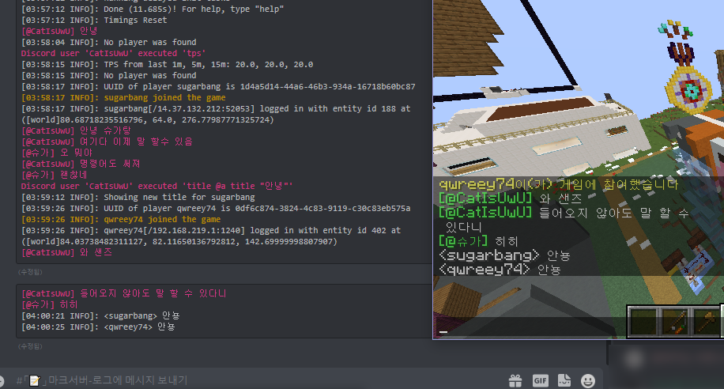
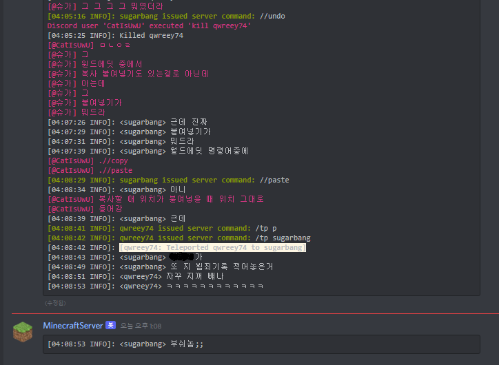
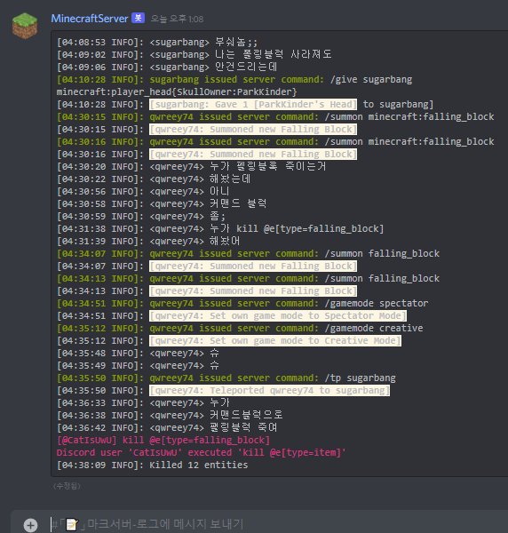

# Disbucket

[You can read this with korean  
한국어로도 이 글을 볼 수 있습니다](./README.kr.md)

> **A minecraft server bucket wrapper for discord that built on luajit/uv**  
This program was built with luajit, so it *insanely fast*  
On 2G ram / ARM64 CPU (2017 model year / 8 core / 2.3GHz clock), it worked smoothy and well
(CPU : 0.3~1%, RAM : 16MB, Result can different by discord server size)  

it connect discord with minecraft server's log, chatting and command  

  
  
  

Type message in discord channel, it will displays on ingame and log  
And you can use command with prefix /  
*(Command execution will require role which you set)*  
Also it support ANSI color, so you can see color on discord and console  

Automatic 2000 character cutting, editing last message to combine, avoid discord limit rate with buffer was implemented too

# Install  

This manual assumes you already have new discord bot, if you don't make new one, [make on here](https://discord.com/developers/applications)  
> https://discord.com/oauth2/authorize?client_id=**YourBotAppId**&permissions=93184&scope=bot  
And add it to your server with this link.  
(If you want more information about creating bot, please just google it)  

Download latest luvit on [here](https://github.com/truemedian/luvit-bin/releases)  
and put it on a directory with the appropriate path (ex : /usr/bin, server directory)  

And clone this repo into your server directory  
```sh
git clone https://github.com/qwreey75/disbucket.git
```
And add disbucket.json on server directory
```jsonc
{
  "token":"You bot token", // Token of your discord bot
  "roleId":"id", // Which role can execute command
  "guildId":"id", // Where guild be logged / read message
  "channelId":"id", // Where channel be logged / read message
  "rate":20, // OPTION, You can set custom rate limit (Don't touch if you don't know)
  "messageFormat":"```ansi\n%s\n```", // OPTION, format of discord logging
  "tellraw":"[{\"color\":\"green\",\"text\":\"[@%s]\"},{\"color\":\"white\",\"text\":\" %s\"}]",
            // OPTION, format of discord message on ingame (follow tellraw json format)
            // first %s will replaced with username
            // second %s will replaced with message
  "command":"[{\"color\":\"gray\",\"text\":\"[@%s] Used : %s\"}]",
            // OPTION, format of discord command execution on ingame (follow tellraw json format)
            // first %s will replaced with username
            // second %s will replaced with command
  "program":"java" // OPTION, you can change program if you want,
                   // Ex : node, lua, luvit, python, bash ... 
}
```
(Your server directory will like be)
```sh
 - Minecraft Server
 | - Bucket.jar (Paper, Spigot ...)
 | - disbucket.json (disbucket settings)
 | - disbucket (disbucket folder)
 | - luvit.exe or luvit (option, you can put it on
 |                       other path)
 | - ... (world , permission , ...)
```
And run this on your server directory  
```sh
luvit disbucket -jar ...
#               ^ this is same with java
#                 arguments, you can set
#                 -Xmx -nogui -Xms ... too
#                 (All arguments will be
#                  passed into java)
```

# Dependent

[luvit/luvit](https://github.com/luvit/luvit) : lua runtime that use luajit and uv bindings  
[luvit/lit](https://github.com/luvit/lit) : module / library manager for luvit  
luvit/fs : file system library for luvit  
luvit/readline : read console input library for luvit  
luvit/timer : timer library for luvit  
luvit/pretty-print : a object dumper for human readable output, stdin-out util for luvit  
[luajit](https://github.com/LuaJIT/LuaJIT) : `just in time` lua runtime  
[qwreey75/promise.lua](https://github.com/qwreey75/promise.lua) promise implementation for luvit  
[qwreey75/mutex.lua](https://github.com/qwreey75/mutex.lua) mutex implementation for luvit  
[creationix/coro-spawn](https://github.com/creationix/coro-spawn) child process implementation for luvit  
[SinisterRectus/Discordia](https://github.com/SinisterRectus/Discordia) discord bot api implementation for luvit  

> Star this repo will helps me~!
